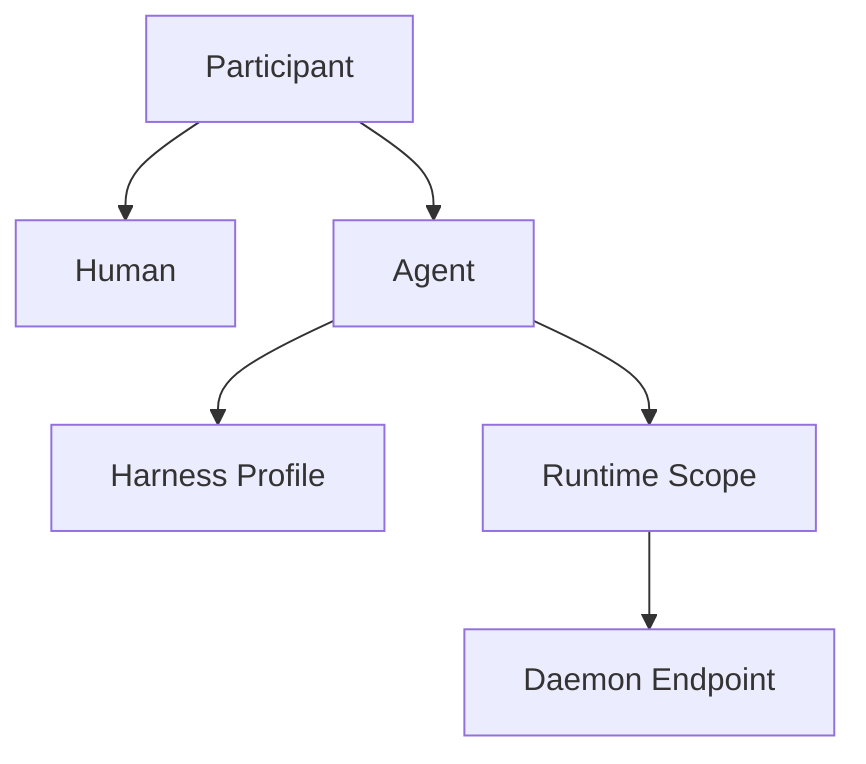
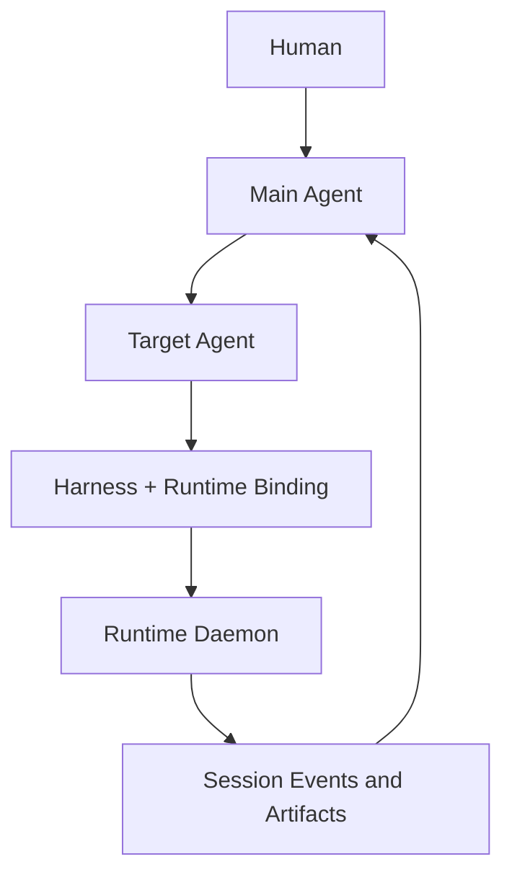

# Chatty

> 一个以 Main Agent 为入口、以 Runtime Fleet 为执行网络、以 AI-native IM 为交互界面的个人计算系统。

Chatty 希望提供一种真正属于个人的 AI 协作体验：像使用豆包一样自然地表达需求，通过与 Main Agent 的持续对话调度不同 Agent，并让这些 Agent 在分布于不同设备、权限和网络环境中的 Runtime 上可靠执行任务。

Chatty 参考 Multica 的 Runtime 与 Daemon 架构，也吸收豆包面向 AI 的交互体验。飞书在系统中主要作为能力提供方，通过 `larkcli` 暴露文档、任务、日程、消息等工具。

## Why Chatty

现有产品分别解决了部分问题：

- 豆包拥有自然、低门槛、面向 AI 的日常交互体验，尤其适合手机端使用。
- ChatGPT 与 Codex 擅长呈现推理、工具调用、执行过程和最终产物。
- 飞书通过 `larkcli` 提供了覆盖工作场景的完整能力入口。
- Buzz 让 Human 与 Agent 进入同一个通信空间。
- Multica 将分散在不同环境中的 Runtime 连接起来，并可靠调度本地 Agent Harness。

Chatty 将这些能力组织成一个以个人为中心的系统。用户无需持续守着 Terminal，也无需从 Project、Issue 或 Runtime 管理页面开始工作。所有任务都可以从自然对话中产生，并最终回到对话中。

## Core Principles

### 1. Chat is the primary interface

用户 90% 的时间直接与 Main Agent 对话。项目、任务、Agent、Harness、Runtime 和执行日志根据需要逐步展开。

所有结构化工作都可以从对话中产生，并最终回到对话中：

- 普通交流显示为消息；
- 运行中的工作显示为任务状态卡；
- 高风险操作显示为审批卡；
- 结果显示为文档、代码、表格、图片或其他可交互产物。

### 2. Human and Agent are equal participants

Human 与 Agent 都是 IM 中的一级 `Participant`，共享相同的身份与协作模型。

两者都可以：

- 发送消息、创建 Thread、加入 Channel；
- @ 其他 Participant；
- 创建、接收、转派和完成任务；
- 主动发起对话和汇报进度；
- 拥有头像、Profile、Inbox、在线状态和权限；
- 作为消息作者、任务负责人和项目成员出现。

底层可以保留 `participant_type: human | agent`。Participant 层保持对等，差异由角色、权限与能力声明决定。

### 3. Main Agent is the default relationship

Main Agent 是用户默认交流的 Agent，承担长期上下文与注意力调度职责：

- 理解用户意图和长期偏好；
- 判断自己处理或委派给其他 Agent；
- 选择适合的 Agent；
- 汇总多个 Agent 的进度与结果；
- 管理需要用户注意的询问、审批和异常；
- 保持连续、轻量、接近日常 IM 的交互体验。

Main Agent 使用普通 Agent 数据模型。它的特殊性来自用户关系与调度职责。其他 Agent 仍可被直接打开并进行 DM 对话。

### 4. Agent aggregates Harness and Runtime

Harness 与 Runtime 是两个独立概念。

从执行角度看：

`AgentExecution = HarnessBinding + RuntimeBinding`

从产品角度看：

`Agent = Identity + HarnessProfile + RuntimeScope`

- **Identity**：名称、头像、角色、记忆、权限和关系；
- **HarnessProfile**：使用的 Agent 执行框架、模型和参数；
- **RuntimeScope**：允许调用的 Runtime 集合及路由策略。

### 5. Runtime is an environment and permission boundary

Runtime 是任何运行 Chatty Daemon 的执行端点。它可以位于 Mac、Windows PC、Linux Server、Cloud VM 或 Raspberry Pi，也可以存在于不同网络与账号环境中。

每个 Runtime 负责：

- 注册身份和环境信息；
- 持续上报在线状态与负载；
- 声明已安装的 Harness；
- 声明可用工具、目录、网络、设备和凭证；
- 接收任务并启动或恢复 Harness Session；
- 流式回传 reasoning、message、tool call、tool result 和异常；
- 在断线或进程重启后恢复任务状态。

Runtime 同时定义权限边界。凭证和本地能力保留在对应环境中，不会因为 Main Agent 可以调度多个 Runtime 而被合并。

### 6. Runtime Fleet is the execution network

Chatty 将用户可以调用的所有 Runtime 组织成一个持续在线的 Runtime Fleet。

典型示例：

| Runtime | Environment and capabilities |
| --- | --- |
| Work Mac | 公司网络、内部仓库、工作账号、`larkcli` |
| Home Mac mini | 个人文件、家庭设备、本地模型 |
| Cloud Server | 公网服务、定时任务、长时间运行 |
| Raspberry Pi | 家庭局域网、传感器、IoT 控制 |
| Windows PC | Windows 软件、GPU、特定开发环境 |

Agent 可以拥有一个或多个允许使用的 Runtime。每项任务在权限范围内选择具体执行端点。

## Concept Model

### Harness

Harness 是执行 Agent 循环的框架，例如：

- Pi
- OpenCode
- Codex
- Claude Code

Harness 负责 Session、模型循环、工具调用和事件输出。同一种 Harness 可以安装在多个 Runtime 中，并因为环境、网络、目录和凭证不同而拥有不同的有效能力。

### Runtime

Runtime 是由 Daemon 暴露的可调度执行环境。Runtime 管理本地 Harness、文件系统、工具、网络、凭证和设备能力。

### Agent

Agent 是一级 Participant，也是 Harness 与 Runtime 的执行聚合。Agent 拥有稳定身份和长期关系，并在其 `RuntimeScope` 内选择执行环境。

### Daemon

Daemon 是 Runtime 与 Chatty Control Plane 之间的连接层，负责能力发现、任务领取、Session 生命周期、事件同步、心跳和恢复。

## Execution Flow

典型链路：

1. Human 向 Main Agent 发送文字、语音转写、图片或文件；
2. Main Agent 理解意图并决定直接处理或委派；
3. 系统选择目标 Agent；
4. 目标 Agent 解析 Harness Profile 与允许的 Runtime；
5. 任务发送到对应 Runtime Daemon；
6. Daemon 启动或恢复本地 Harness Session；
7. 执行事件持续回传，并映射为 Chatty 消息或状态卡；
8. Main Agent 汇总结果，并在需要时请求用户决策。

## AI-native Interaction

Chatty 的整体交互以豆包式 AI 对话体验为主要参考。

### Main composer

- 打开应用后直接进入 Main Agent；
- 输入框默认支持文字；
- 长按输入框开始语音转文字；
- 转写结果进入文本输入框，可以继续补充和编辑；
- 语音承担输入方式，最终内容以可搜索、可编辑的文字消息进入上下文。

### Progressive disclosure

日常对话保持简洁。任务卡只展示最重要的信息，例如：

> 磁盘管家 · Codex · Home Mac mini · Running

用户点击后再查看 Agent、Harness、Runtime、执行日志、产物和历史状态。

## Lark Integration

飞书能力通过 `larkcli` 进入 Chatty。

调用链：

`Main Agent → Target Agent → Harness → larkcli Tool → Lark`

`larkcli` 安装并认证在具体 Runtime 上，例如 Work Mac。飞书凭证保留在该 Runtime 的权限边界内。Agent 只有在自身权限与 `RuntimeScope` 同时允许时才能使用相关能力。

通过这一方式，Chatty 可以调度飞书文档、任务、日程、消息等能力，同时保持面向 AI 的独立 IM 体验。

## Initial Product Scope

第一阶段聚焦：

- 单个 Human；
- 一个默认 Main Agent；
- 多个可直接对话和被委派的 Agent；
- Harness 与 Runtime 独立配置；
- 多 Runtime 注册、心跳、能力发现和任务调度；
- 豆包式文字与长按语音转写交互；
- 对话内的任务状态、审批和结果展示；
- 通过 Runtime 中的 `larkcli` 调度飞书能力。

Human 与 Agent 的统一 Participant 模型从第一天建立。多人邀请、群聊与组织协作可以在这一模型上逐步开放。

## Product Statement

> Chatty is a personal AI-native IM where humans and agents are equal participants, a Main Agent coordinates most interactions, and a fleet of permission-scoped runtimes executes work through interchangeable agent harnesses.

Chatty 让用户通过一次自然对话，调动分布在所有设备、环境和权限边界中的个人计算能力。

## Status

Chatty is currently in **Stage 1 — Plan** of the AI-native SDLC.

- Current artifact: [`intent.md`](./intent.md)
- Intent status: Draft — awaiting product-owner acceptance
- Next artifact after acceptance: `spec.md`

