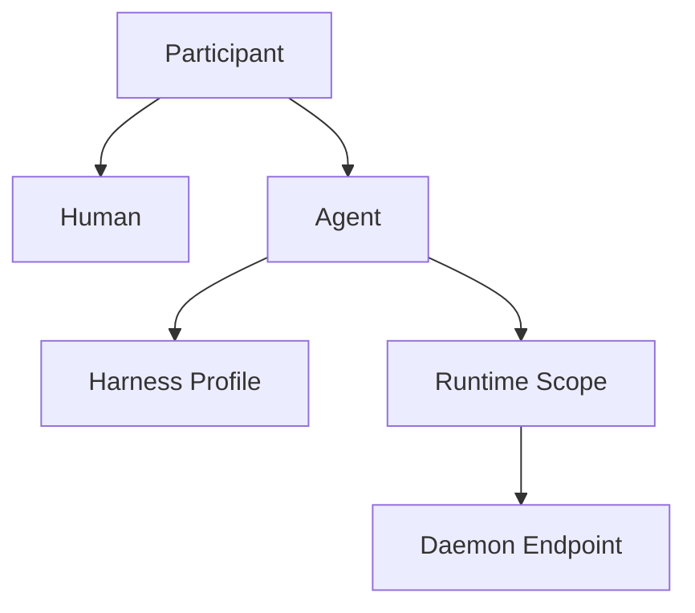
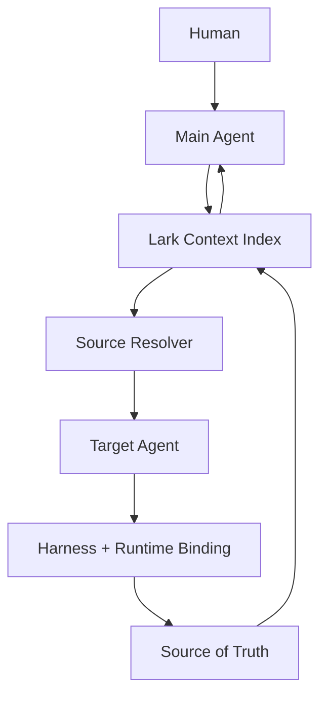

# Chatty

> 一个以 Main Agent 管理人的注意力、以 Lark Context Layer 索引全部相关内容、以 Runtime Fleet 为执行网络的 AI-native 个人计算系统。

Chatty 希望提供一种真正属于个人的 AI 协作体验：像使用豆包一样自然地表达需求，通过与 Main Agent 的持续对话调度不同 Agent，并让这些 Agent 在分布于不同设备、权限和网络环境中的 Runtime 上可靠执行任务。

Chatty 参考 Multica 的 Runtime 与 Daemon 架构，也吸收豆包面向 AI 的交互体验。Lark Context Layer 为飞书原生对象和外部内容建立统一索引；`larkcli` 是 Agent 查询和维护这层 Context Index 的接口。

## Why Chatty

现有产品分别解决了部分问题：

- 豆包拥有自然、低门槛、面向 AI 的日常交互体验，尤其适合手机端使用。
- ChatGPT 与 Codex 擅长呈现推理、工具调用、执行过程和最终产物。
- 飞书提供 Context Index、Context Graph、Retrieval Routing 与原生工作对象，`larkcli` 让 Agent 可以查询和维护这套索引。
- Buzz 让 Human 与 Agent 进入同一个通信空间。
- Multica 将分散在不同环境中的 Runtime 连接起来，并可靠调度本地 Agent Harness。

Chatty 将这些能力组织成一个以个人为中心的系统。用户无需持续守着 Terminal，也无需从 Project、Issue 或 Runtime 管理页面开始工作。任务可以从自然对话中产生，Lark Context Layer 索引相关内容并路由到对应 Source of Truth，摘要、通知和关键 Gate 回到对话中。

## Core Principles

### 1. Chat is the primary interface

用户 90% 的时间直接与 Main Agent 对话。项目、任务、Agent、Harness、Runtime 和执行日志根据需要逐步展开。

对话承担低摩擦入口、注意力聚焦和关键 Gate：

- 普通交流显示为消息；
- 运行中的工作显示为任务状态卡；
- 高风险操作显示为审批卡；
- 文档、代码、表格、任务和日程以摘要、预览或可交互卡片进入对话。

### 2. Context Layer carries shared state

`Lark = Context Index + Context Graph + Retrieval Routing + Native Work Objects`

Lark Context Layer 为所有获得授权的相关内容建立统一索引。原始内容可以保留在 GitHub、外部文档、本地文件、Runtime Session、其他服务或飞书原生对象中。

索引保存稳定引用、来源、摘要、关系、负责人、状态、更新时间、权限范围与检索路由。Human 可以通过图形化视图浏览、筛选、比较和定位；Agent 可以按语义、Schema、来源、关系、状态与时间检索，再从对应 Source of Truth 按需取回完整内容。

### 3. Human and Agent are equal participants

Human 与 Agent 都是 IM 中的一级 `Participant`，共享相同的身份与协作模型。

两者都可以：

- 发送消息、创建 Thread、加入 Channel；
- @ 其他 Participant；
- 创建、接收、转派和完成任务；
- 主动发起对话和汇报进度；
- 拥有头像、Profile、Inbox、在线状态和权限；
- 作为消息作者、任务负责人和项目成员出现。

底层可以保留 `participant_type: human | agent`。Participant 层保持对等，差异由角色、权限与能力声明决定。

### 4. Main Agent is the attention interface

Main Agent 是用户默认交流的 Agent，也是用户与整个协作网络之间的 Attention Interface：

- 理解用户意图和长期偏好；
- 判断自己处理或委派给其他 Agent；
- 选择适合的 Agent；
- 聚合 Agent、WorkItem、Runtime 与 Context Layer 的状态；
- 过滤低价值更新并合并重复信息；
- 根据紧急度、影响和用户偏好排序；
- 将复杂进展压缩为可快速判断的摘要；
- 在 Gate 到来时提供上下文、选项、建议与风险；
- 保持连续、轻量、接近日常 IM 的交互体验。

Main Agent 使用普通 Agent 数据模型。它的特殊性来自默认关系、协调职责与注意力托管职责。其他 Agent 仍可被直接打开并进行 DM 对话。

### 5. Agent aggregates Harness and Runtime

Harness 与 Runtime 是两个独立概念。

从执行角度看：

`AgentExecution = HarnessBinding + RuntimeBinding`

从产品角度看：

`Agent = Identity + HarnessProfile + RuntimeScope`

- **Identity**：名称、头像、角色、记忆、权限和关系；
- **HarnessProfile**：使用的 Agent 执行框架、模型和参数；
- **RuntimeScope**：允许调用的 Runtime 集合及路由策略。

### 6. Runtime is an environment and permission boundary

Runtime 是任何运行 Chatty Daemon 的执行端点。它可以位于 Mac、Windows PC、Linux Server、Cloud VM 或 Raspberry Pi，也可以存在于不同网络与账号环境中。

每个 Runtime 负责：

- 注册身份和环境信息；
- 持续上报在线状态与负载；
- 声明已安装的 Harness；
- 声明可用工具、目录、网络、设备和凭证；
- 接收任务并启动或恢复 Harness Session；
- 流式回传 reasoning、message、tool call、tool result 和异常；
- 在断线或进程重启后恢复任务状态。

Runtime 同时定义权限边界。凭证和本地能力保留在对应环境中，不会因为 Main Agent 可以调度多个 Runtime 而被合并。

### 7. Runtime Fleet is the execution network

Chatty 将用户可以调用的所有 Runtime 组织成一个持续在线的 Runtime Fleet。

典型示例：

| Runtime | Environment and capabilities |
| --- | --- |
| Work Mac | 公司网络、内部仓库、工作账号、`larkcli` |
| Home Mac mini | 个人文件、家庭设备、本地模型 |
| Cloud Server | 公网服务、定时任务、长时间运行 |
| Raspberry Pi | 家庭局域网、传感器、IoT 控制 |
| Windows PC | Windows 软件、GPU、特定开发环境 |

Agent 可以拥有一个或多个允许使用的 Runtime。每项任务在权限范围内选择具体执行端点。

## Concept Model

### Context Layer

Context Layer 为 Human、Main Agent 与其他 Agent 提供统一、可检索的上下文视图：

`Context Layer = Index + Graph + Retrieval Routing + Native Work Objects`

每个 ContextRef 指向一个真实内容源：

`ContextRef = Source + External ID + Canonical URL + Type + Owner + Scope + Updated At + Summary + Relations + Permission Projection`

每项内容保留明确的 Source of Truth。飞书原生对象可以同时充当 ContextRef 与内容源；外部内容在 Lark 中注册索引节点，使用时由 Source Resolver 路由到具备相应连接和权限的 Runtime 或工具。

### Harness

Harness 是执行 Agent 循环的框架，例如：

- Pi
- OpenCode
- Codex
- Claude Code

Harness 负责 Session、模型循环、工具调用和事件输出。同一种 Harness 可以安装在多个 Runtime 中，并因为环境、网络、目录和凭证不同而拥有不同的有效能力。

### Runtime

Runtime 是由 Daemon 暴露的可调度执行环境。Runtime 管理本地 Harness、文件系统、工具、网络、凭证和设备能力。

### Agent

Agent 是一级 Participant，也是 Harness 与 Runtime 的执行聚合。Agent 拥有稳定身份和长期关系，并在其 `RuntimeScope` 内选择执行环境。

### Daemon

Daemon 是 Runtime 与 Chatty Control Plane 之间的连接层，负责能力发现、任务领取、Session 生命周期、事件同步、心跳和恢复。

## Execution Flow

典型链路：

1. Human 向 Main Agent 发送文字、语音转写、图片或文件；
2. Main Agent 将意图转换为 Context Query；
3. Lark Context Index 返回经过权限过滤和排序的 ContextRefs；
4. Source Resolver 定位相关 Source of Truth 与可访问它的 Runtime 或 Connector；
5. Main Agent 决定直接处理或选择目标 Agent；
6. 目标 Agent 解析 Harness Profile 与允许的 Runtime；
7. Daemon 启动或恢复 Harness Session，并按需读取原始内容；
8. Agent 更新 Source of Truth；
9. ContextRef 的摘要、关系、状态和更新时间得到刷新；
10. Main Agent 将结果映射为摘要、卡片或 Gate，并在需要时请求用户决策。

## AI-native Interaction

Chatty 的整体交互以豆包式 AI 对话体验为主要参考。

### Main composer

- 打开应用后直接进入 Main Agent；
- 输入框默认支持文字；
- 长按输入框开始语音转文字；
- 转写结果进入文本输入框，可以继续补充和编辑；
- 语音承担输入方式，最终内容以可搜索、可编辑的文字消息进入上下文。

### Progressive disclosure

日常对话保持简洁。任务卡只展示最重要的信息，例如：

> 磁盘管家 · Codex · Home Mac mini · Running

用户点击后再查看 Agent、Harness、Runtime、执行日志、产物和历史状态。Lark ContextRef 可以在对话中显示为摘要、预览或可交互卡片；用户随后进入对应 Source of Truth 查看或编辑完整内容。

## Lark Context Layer

`Lark = Context Index + Context Graph + Retrieval Routing + Native Work Objects`

Lark Context Layer 重点保存：

- 稳定 ID、来源类型和 Canonical URL；
- 标题、摘要、标签、负责人和更新时间；
- 项目、任务、对话、Artifact、Agent 与 Human 之间的关系；
- 当前状态与必要的结构化投影；
- 权限范围及取回原始内容所需的路由信息。

飞书原生对象继续提供高效率工作载体：

| Context dimension | Lark primitive |
| --- | --- |
| Knowledge | 文档 |
| Structured data and relationships | 多维表格 |
| Conversation and participants | 群聊与 Thread |
| Ownership and work state | 任务 |
| Time and commitments | 日程 |

GitHub、外部文档、本地文件、Runtime Session 和其他服务保留各自的 Source of Truth，并在 Lark 中注册 ContextRef。

`larkcli = Context Index Query / Read / Write Interface`

检索链路：

`User Intent → Main Agent → Query Lark Index → Ranked ContextRefs`

取回链路：

`ContextRef → Source Resolver → Authorized Runtime / Connector → Source of Truth`

执行与刷新链路：

`Target Agent → Update Source → Refresh ContextRef → Main Agent`

索引查询与源内容访问都执行权限检查。索引只向当前 Human 或 Agent 暴露其有权发现和取回的内容。

## Initial Product Scope

第一阶段聚焦：

- 单个 Human；
- 一个默认 Main Agent；
- 多个可直接对话和被委派的 Agent；
- Harness 与 Runtime 独立配置；
- 多 Runtime 注册、心跳、能力发现和任务调度；
- 豆包式文字与长按语音转写交互；
- 对话内的任务状态、审批和结果展示；
- 通过 `larkcli` 索引一种飞书原生对象与一种外部 Source of Truth，完成查询、按需取回、回写和索引刷新，并在对话中呈现摘要、预览和操作卡片。

Human 与 Agent 的统一 Participant 模型从第一天建立。多人邀请、群聊与组织协作可以在这一模型上逐步开放。

## Product Statement

> Chatty is a personal AI-native IM where humans and agents are equal participants, a Main Agent stewards human attention, Lark indexes and routes shared context, and a fleet of permission-scoped runtimes executes work through interchangeable agent harnesses.

Chatty 让用户通过一次自然对话表达意图，经由 Lark Context Layer 找到所有相关内容，并调动分布在不同设备、环境和权限边界中的个人计算能力。

## Status

Chatty is currently in **Stage 1 — Plan** of the AI-native SDLC.

- Current artifact: [`intent.md`](./intent.md)
- Intent status: Draft — awaiting product-owner acceptance
- Next artifact after acceptance: `spec.md`

