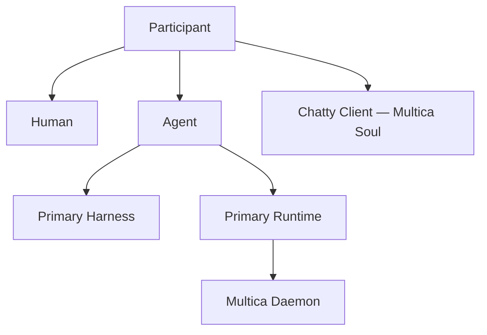

# Chatty

> 一个 ChatGPT 式手机体验的 Multica 客户端：以 Mika（Main Agent）管理人的注意力，以 Multica Agent Fleet + Runtime Fleet 为背后灵魂。

Chatty 是 **Multica 的移动端 thin client**：身份、任务、协调与执行的事实源全部在 Multica，不重新实现、不建立第二真值。Chatty 提供一种真正属于个人的 AI 协作体验——像使用 ChatGPT 手机应用一样自然地表达需求，通过 Mika（Multica 核心管理人）调度不同 Agent，并让这些 Agent 在分布于不同设备、权限和网络环境中的 Runtime 上可靠执行任务。

Chatty 直接复用 Multica 的 Runtime、Daemon 与连接能力，也吸收 ChatGPT 手机应用的设计语言与面向 AI 的交互体验。

> **Lark Context Layer 定位说明：** 本文档下文保留的 Lark Context Layer / Context Index / `larkcli` 描述，是 v1 探索阶段留下的长期概念设想，**不属于 v2 V1 范围**。`iterations/v2/intent.md` 已明确将「飞书 / Lark Context Layer 深度集成」列为 Out of scope（候选后续增强）。v2 当前轮次以 [`iterations/v2/spec.md`](./iterations/v2/spec.md) 为准；下文涉及 Lark 的章节仅作为未来候选方向保留，读者应以 Stage 状态指针（见文末 `Status`）判断当前轮次的真实范围。

## Why Chatty

现有产品分别解决了部分问题：

- ChatGPT 手机应用拥有自然、低门槛、面向 AI 的日常交互体验与成熟的设计语言，是 Chatty 客户端的基准；豆包式长按语音转文字作为移动输入方式参考。
- ChatGPT 与 Codex 擅长呈现推理、工具调用、执行过程和最终产物。
- Multica 提供 Chatty 的灵魂层：Mika（核心管理人）+ Agent Fleet + Runtime Fleet + Project / Issue / Task，直接承担协调、Daemon、连接、认证、心跳、恢复与本地 Agent Harness 调度。
- （候选后续增强，不在 V1 范围）飞书可提供 Context Index、Context Graph、Retrieval Routing 与原生工作对象，`larkcli` 让 Agent 可以查询和维护这套索引——见上方定位说明。

Chatty 将这些能力组织成一个以个人为中心的系统。用户无需持续守着 Terminal，也无需从 Project、Issue 或 Runtime 管理页面开始工作。V1 的任务闭环从对话直接产生，摘要、通知和关键 Gate 回到对话中；Lark Context Layer 索引与路由是候选的后续增强，不是 V1 依赖。

## Core Principles

### 1. Chat is the primary interface

用户 90% 的时间直接与 Main Agent 对话。项目、任务、Agent、Harness、Runtime 和执行日志根据需要逐步展开。

对话承担低摩擦入口、注意力聚焦和关键 Gate：

- 普通交流显示为消息；
- 运行中的工作显示为任务状态卡；
- 高风险操作显示为审批卡；
- 文档、代码、表格、任务和日程以摘要、预览或可交互卡片进入对话。

### 2. Context Layer carries shared state (候选后续能力，V1 范围外)

> 本节描述的 Lark Context Layer 是长期概念设想，未包含在 v2 V1 范围（见文首定位说明与 `iterations/v2/intent.md` Out of scope）。V1 不依赖此层。

`Lark = Context Index + Context Graph + Retrieval Routing + Native Work Objects`

Lark Context Layer 为所有获得授权的相关内容建立统一索引。原始内容可以保留在 GitHub、外部文档、本地文件、Runtime Session、其他服务或飞书原生对象中。

索引保存稳定引用、来源、摘要、关系、负责人、状态、更新时间、权限范围与检索路由。Human 可以通过图形化视图浏览、筛选、比较和定位；Agent 可以按语义、Schema、来源、关系、状态与时间检索，再从对应 Source of Truth 按需取回完整内容。

### 3. Human and Agent are equal participants

Human 与 Agent 都是 IM 中的一级 `Participant`，共享相同的身份与协作模型。

两者都可以：

- 发送消息、创建 Thread、加入 Channel；
- @ 其他 Participant；
- 创建、接收、转派和完成任务；
- 主动发起对话和汇报进度；
- 拥有头像、Profile、Inbox、在线状态和权限；
- 作为消息作者、任务负责人和项目成员出现。

底层可以保留 `participant_type: human | agent`。Participant 层保持对等，差异由角色、权限与能力声明决定。

**Decision:** Chatty 不自建 Communication Core。身份、对话、任务与状态的事实源在 Multica workspace（Mika + Agent Fleet + Runtime Fleet）；客户端只做 ChatGPT 式体验层投影。

### 4. Main Agent is the attention interface

Main Agent（Mika，Multica 核心管理人）是用户默认交流的 Agent，也是用户与整个协作网络之间的 Attention Interface：

- 理解用户意图和长期偏好；
- 判断自己处理或委派给其他 Agent；
- 选择适合的 Agent；
- 聚合 Agent、WorkItem 与 Runtime 的状态（跨 Context Layer 的聚合是候选后续能力，不在 V1 范围）；
- 过滤低价值更新并合并重复信息；
- 根据紧急度、影响和用户偏好排序；
- 将复杂进展压缩为可快速判断的摘要；
- 在 Gate 到来时提供上下文、选项、建议与风险；
- 保持连续、轻量、接近日常 IM 的交互体验。

Main Agent 使用普通 Agent 数据模型。它的特殊性来自默认关系、协调职责与注意力托管职责。其他 Agent 仍可被直接打开并进行 DM 对话。

### 5. Agent aggregates Harness and Runtime

Harness 与 Runtime 是两个独立概念。

从执行角度看：

`AgentExecution = PrimaryHarnessBinding + PrimaryRuntimeBinding`

从产品角度看：

`Agent = Identity + PrimaryHarnessBinding + PrimaryRuntimeBinding + RuntimeScope`

- **Identity**：名称、头像、角色、记忆、权限和关系；
- **PrimaryHarnessBinding**：默认 Harness、模型和参数；
- **PrimaryRuntimeBinding**：Agent 持续工作的主 Multica Runtime；
- **RuntimeScope**：用户可以通过显式 Gate 手动改绑的 Runtime 边界。

WorkItem 创建时会快照固定的 ExecutionBinding。主 Runtime 离线或繁忙时，WorkItem 等待原 Runtime 恢复，系统不执行自动 Failover。

### 6. Runtime is an environment and permission boundary

Runtime 是由 Multica Daemon 暴露并由 Multica 管理的执行端点。它可以位于 Mac、Windows PC、Linux Server、Cloud VM 或 Raspberry Pi，也可以存在于不同网络与账号环境中。

每台 Runtime 只需满足 Multica 当前实现所要求的网络条件。Runtime 的发现、注册、身份验证、安全连接、心跳、重连、任务领取、Session 执行、事件回传与撤销全部由 Multica 负责。

Runtime 同时定义权限边界。凭证和本地能力保留在对应环境中，不会因为 Main Agent 可以调用多个 Runtime 而被合并。

### 7. Multica Runtime Fleet is the execution network

Chatty 直接使用 Multica 已注册和管理的 Runtime Fleet。

典型示例：

| Runtime | Environment and capabilities |
| --- | --- |
| Work Mac | 公司网络、内部仓库、工作账号 |
| Home Mac mini | 个人文件、家庭设备、本地模型 |
| Cloud Server | 公网服务、定时任务、长时间运行 |
| Raspberry Pi | 家庭局域网、传感器、IoT 控制 |
| Windows PC | Windows 软件、GPU、特定开发环境 |

Chatty 通过 `MulticaRuntimeProvider` 将 Agent、ExecutionBinding、WorkItem、Run / Step 与 Multica 的 Runtime、任务、Session 和事件关联。当前 ContextSpace 和 RuntimeScope 决定可见范围；Agent 使用稳定的主 Runtime，离线或繁忙时等待恢复。

## Concept Model

### Client Experience Layer

Chatty 客户端是 ChatGPT 式的体验层，不持有第二真值：身份、对话、任务与状态的事实源在 Multica workspace。

- Mika（Main Agent）与专业 Agent 直接来自 Multica Agent Fleet；
- 客户端映射 Multica 的 Agent / Issue / Task / Run / Event 为消息、状态卡、Artifact 与 Evidence；
- 渐进展开、Approval / Decision Card、搜索与 Activity 展示是 Multica 状态的客户端投影；
- Work / Life 等空间概念映射为 Multica workspace / project 的视图；
- 对话负责入口、摘要、通知与 Gate；完整内容保留在各自的 Source of Truth。

### Context Layer（候选后续能力，V1 范围外）

> 未包含在 v2 V1 范围，见文首定位说明。

Context Layer 为 Human、Main Agent 与其他 Agent 提供统一、可检索的上下文视图：

`Context Layer = Index + Graph + Retrieval Routing + Native Work Objects`

每个 ContextRef 指向一个真实内容源：

`ContextRef = Source + External ID + Canonical URL + Type + Owner + Scope + Updated At + Summary + Relations + Permission Projection`

每项内容保留明确的 Source of Truth。飞书原生对象可以同时充当 ContextRef 与内容源；外部内容在 Lark 中注册索引节点，使用时由 Source Resolver 路由到具备相应连接和权限的 Runtime 或工具。

### Harness

Harness 是执行 Agent 循环的框架，例如：

- Pi
- OpenCode
- Codex
- Claude Code

Harness 负责 Session、模型循环、工具调用和事件输出。同一种 Harness 可以安装在多个 Runtime 中，并因为环境、网络、目录和凭证不同而拥有不同的有效能力。

Harness Adapter 将各 Provider 的输出映射到统一的 Canonical Event Model：

- Session 与 Turn 生命周期；
- Message 与 Reasoning Summary；
- Tool Call 与 Permission；
- Artifact 与 Evidence；
- Progress、Usage 与 Error。

每个事件保留 Provider 原始 Payload。遇到尚未识别的事件时，Chatty 生成 `activity.generic`，将它关联到对应 WorkItem 和 Run / Step，在界面中提供可展开的原始数据，并继续当前 Run。高频 Generic Activity 可以在后续 Schema 版本中升级为正式 Canonical Event。

### Runtime

Runtime 是由 Multica Daemon 暴露的可调度执行环境。Chatty 通过 `MulticaRuntimeProvider` 引用 Runtime；Multica 管理其连接、状态、Harness、文件系统、工具、网络、凭证和设备能力。

### Agent

Agent 是一级 Participant，也是 Harness 与 Runtime 的执行聚合。Agent 拥有稳定身份、主 Harness 与主 Runtime；`RuntimeScope` 约束用户可以显式改绑的范围。

### Daemon

Daemon 直接使用 Multica Daemon，负责能力发现、任务领取、Session 生命周期、事件同步、心跳和恢复。Chatty 通过 `MulticaRuntimeProvider` 接收并映射这些状态与事件。

## Execution Flow

> 下图与 10 步链路是长期概念设想（含 Lark Context Index / Source Resolver 步骤），**不是 v2 V1 的实现范围**。V1 实际链路见下方「V1 简化链路」，并以 [`iterations/v2/spec.md`](./iterations/v2/spec.md) §1 为准。

概念链路（含候选后续能力）：

1. Human 向 Main Agent 发送文字、语音转写、图片或文件；
2. Main Agent 将意图转换为 Context Query；
3. Lark Context Index 返回经过权限过滤和排序的 ContextRefs；
4. Source Resolver 定位相关 Source of Truth 与可访问它的 Runtime 或 Connector；
5. Main Agent 决定直接处理或选择目标 Agent；
6. 目标 Agent 加载固定的主 Harness 与主 Multica Runtime；
7. Multica Daemon 启动或恢复 Harness Session，并按需读取原始内容；
8. Agent 更新 Source of Truth；
9. ContextRef 的摘要、关系、状态和更新时间得到刷新；
10. Main Agent 将结果映射为摘要、卡片或 Gate，并在需要时请求用户决策。

**V1 简化链路**（无 Lark Context Index / Source Resolver 步骤）：

1. Human 向 Mika 发送文字或语音转写文字；
2. Mika 决定直接处理或委派给目标 Agent；
3. 目标 Agent 加载固定的主 Harness 与主 Multica Runtime；
4. Multica Daemon 启动或恢复 Harness Session；
5. Agent 执行并产出结果（含附件/Evidence）；
6. Mika 将结果映射为摘要、状态卡或需要人工确认的卡片，回到同一段对话。

## AI-native Interaction

Chatty 的整体交互以 ChatGPT 手机应用的设计语言为主要参考（语音输入采纳豆包式长按转写）。

### Main composer

- 打开应用后直接进入 Main Agent；
- 输入框默认支持文字；
- 长按输入框开始语音转文字；
- 转写结果进入文本输入框，可以继续补充和编辑；
- 语音承担输入方式，最终内容以可搜索、可编辑的文字消息进入上下文。

### Progressive disclosure

日常对话保持简洁。任务卡只展示最重要的信息，例如：

> 磁盘管家 · Codex · Home Mac mini · Running

用户点击后再查看 Agent、Harness、Runtime、执行日志、产物和历史状态。（候选后续能力，V1 范围外）Lark ContextRef 可以在对话中显示为摘要、预览或可交互卡片；用户随后进入对应 Source of Truth 查看或编辑完整内容。

## Lark Context Layer（候选后续能力，V1 范围外）

> 本节未包含在 v2 V1 范围，见文首定位说明与 `iterations/v2/intent.md` Out of scope。

`Lark = Context Index + Context Graph + Retrieval Routing + Native Work Objects`

Lark Context Layer 重点保存：

- 稳定 ID、来源类型和 Canonical URL；
- 标题、摘要、标签、负责人和更新时间；
- 项目、任务、对话、Artifact、Agent 与 Human 之间的关系；
- 当前状态与必要的结构化投影；
- 权限范围及取回原始内容所需的路由信息。

飞书原生对象继续提供高效率工作载体：

| Context dimension | Lark primitive |
| --- | --- |
| Knowledge | 文档 |
| Structured data and relationships | 多维表格 |
| Conversation and participants | 群聊与 Thread |
| Ownership and work state | 任务 |
| Time and commitments | 日程 |

GitHub、外部文档、本地文件、Runtime Session 和其他服务保留各自的 Source of Truth，并在 Lark 中注册 ContextRef。

`larkcli = Context Index Query / Read / Write Interface`

检索链路：

`User Intent → Main Agent → Query Lark Index → Ranked ContextRefs`

取回链路：

`ContextRef → Source Resolver → Authorized Runtime / Connector → Source of Truth`

执行与刷新链路：

`Target Agent → Update Source → Refresh ContextRef → Main Agent`

索引查询与源内容访问都执行权限检查。索引只向当前 Human 或 Agent 暴露其有权发现和取回的内容。

## Product Scope（跨轮次概念，非本轮 V1 清单）

> 本节是产品长期概念范围，不是本轮 V1 的权威范围声明。**v2 V1 的实际范围以 `iterations/v2/intent.md` 「Initial scope」/「Out of scope」与 `iterations/v2/spec.md` 为准**——两者都明确排除飞书 / Lark Context Layer 深度集成。

概念范围（跨轮次）：

- 单个 Human；
- 一个全局 Main Agent 身份（Mika，Multica 核心管理人）；
- Chatty 客户端：ChatGPT 式沉浸对话、消息流、长按语音转写、状态卡、渐进展开与 Approval / Decision Cards；
- 复用 Multica Agent Fleet：多个可直接对话和被委派的 Agent；
- Harness 与 Runtime 配置由 Multica 管理；
- 客户端映射核心事件语义，未知事件显示 Generic Activity、保留原始 Payload并继续执行；
- 通过 `MulticaRuntimeProvider` 接入 Multica Runtime Fleet，并映射状态、任务、Session、事件与恢复；
- 手机优先的文字与长按语音转写交互；
- 对话内的任务状态、审批和结果展示。

候选后续能力（不在 v2 V1 范围）：

- 通过 `larkcli` 索引飞书原生对象与外部 Source of Truth，完成查询、按需取回、回写和索引刷新，并在对话中呈现摘要、预览和操作卡片。

Human 与 Agent 的统一 Participant 模型从第一天建立。多人邀请、群聊与组织协作可以在这一模型上逐步开放。

## Product Statement

> Chatty is a ChatGPT-style mobile client for Multica: Mika stewards human attention, the Multica Agent Fleet and Runtime Fleet execute work, and the client is a thin projection over the Multica workspace — no second source of truth.

Chatty 让用户通过一次自然对话表达意图，调动分布在不同设备、环境和权限边界中的个人计算能力；Lark Context Layer 索引与路由是候选的后续增强，不是当前轮次的依赖（见文首定位说明）。

## Status

Chatty 当前处于 **Stage 4 — Implementation（进行中）**。

- 当前轮次：**v2**。
- 规格：[`iterations/v2/spec.md`](./iterations/v2/spec.md)，CLE-56 已验收。
- 执行清单：[`iterations/v2/ISSUES.md`](./iterations/v2/ISSUES.md)，对应 Multica CLE-57 下 M0–M10。
- 本轮：2026-09-05，按用户指示在 Mac + USB Pixel 6 Pro 上完成工程、登录和 Chat 核心开发；真实历史可读，合成收发闭环通过，真实新消息收发仍待验收。
- Chat 源码覆盖：[`iterations/v2/CHAT_SOURCE_PARITY.md`](./iterations/v2/CHAT_SOURCE_PARITY.md)。
- 验收记录：[`iterations/v2/EVAL.md`](./iterations/v2/EVAL.md)，仅通过有实际证据的项目。
- 源码：[`android/`](./android/)。
- 工程闭环：[`docs/android-dev-loop.md`](./docs/android-dev-loop.md)。
- 生命周期规则：[`docs/sdlc-workflow.md`](./docs/sdlc-workflow.md)。
- 全部 V2 功能完成前，不进入 Stage 5 正式总体评估或声明 V2 发布完成。
