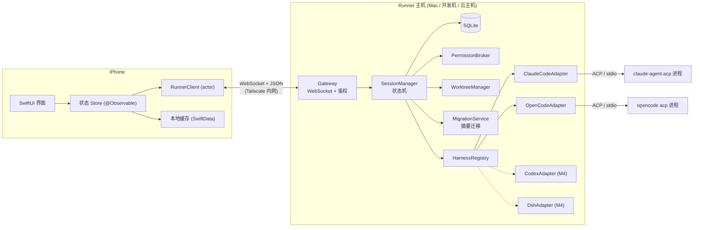
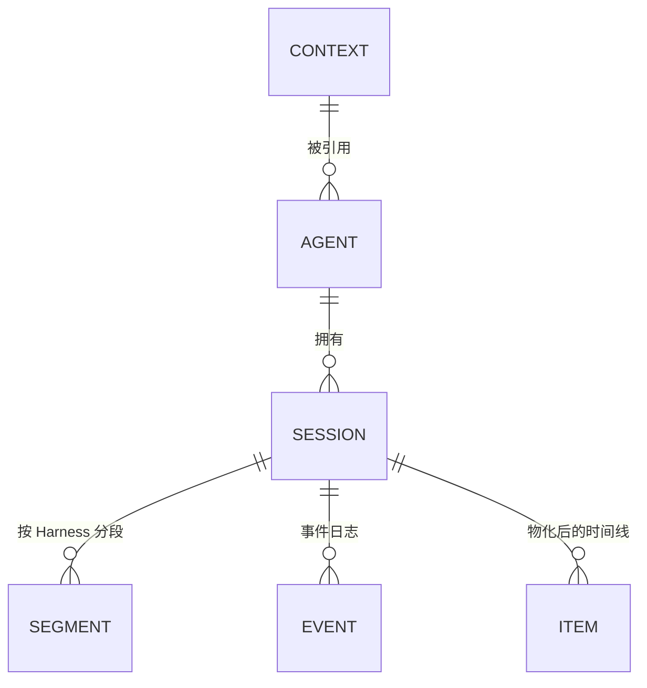
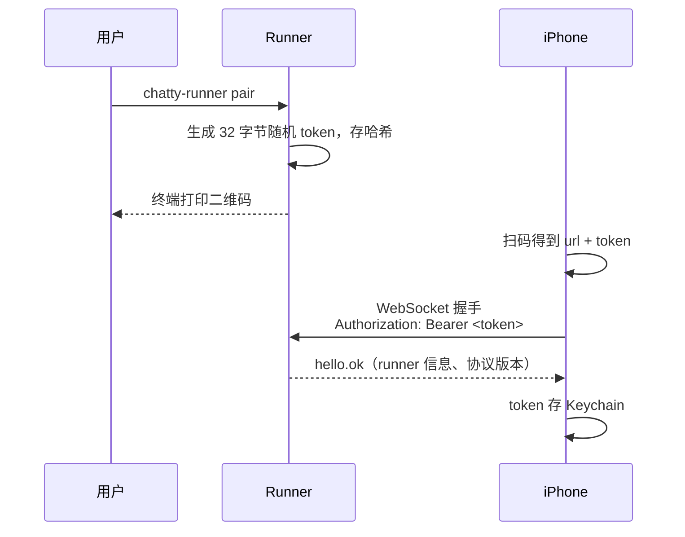
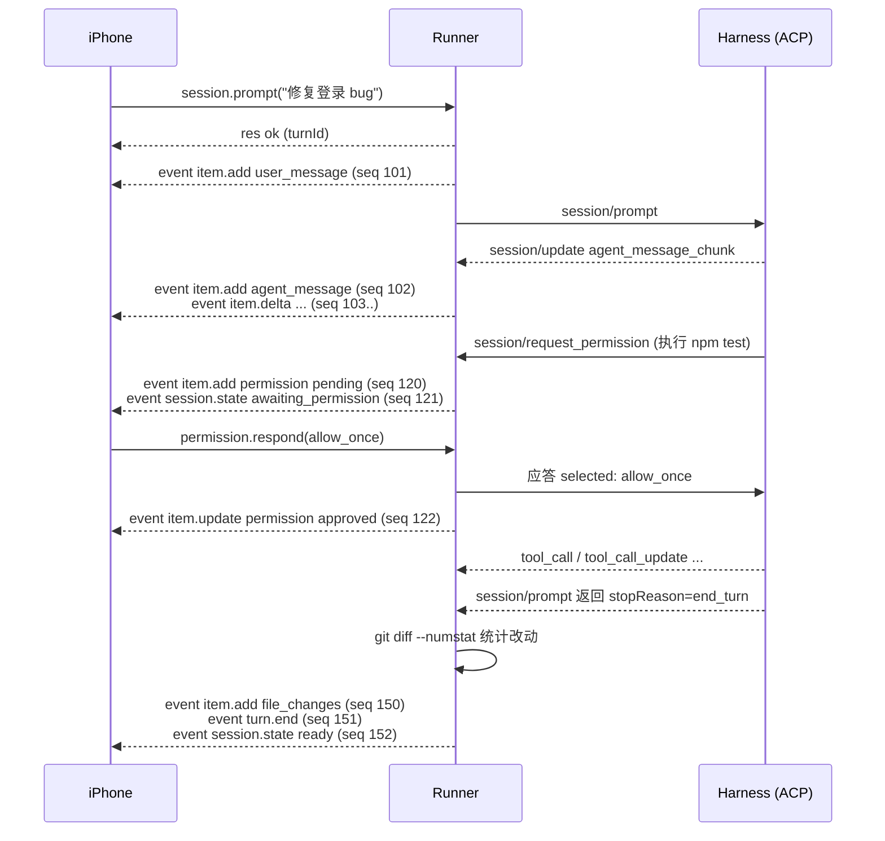
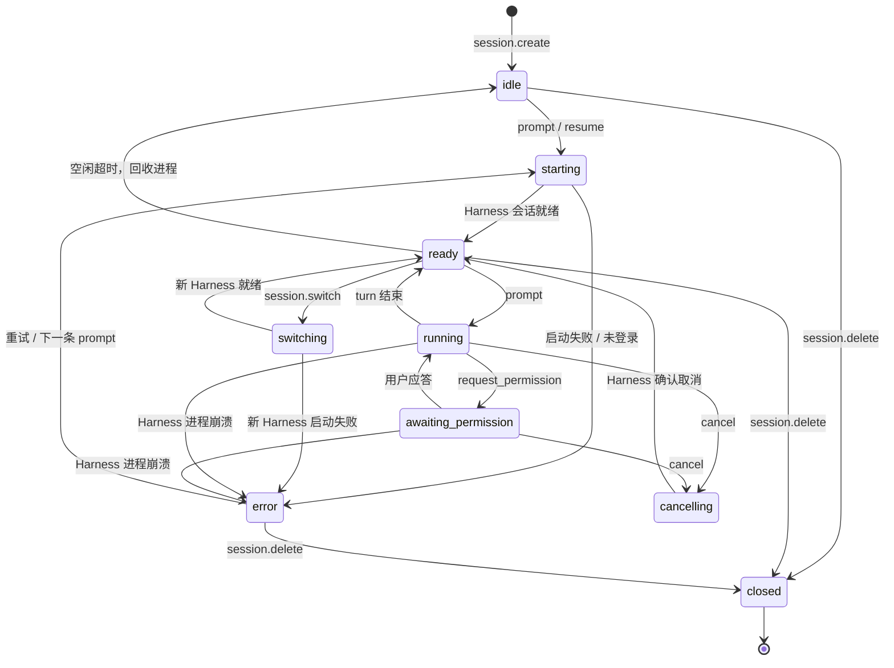
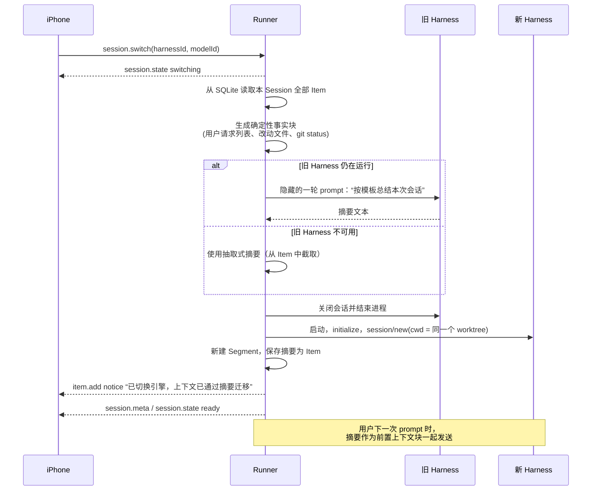

# 架构设计

- 状态：草案 v0.1，等待确认
- 日期：2026-09-25
- 相关文档：[harness-adapters.md](harness-adapters.md)、[compatibility-matrix.md](compatibility-matrix.md)

## 1. 目标与边界

目标：

- 用手机驱动运行在 Mac / 开发机 / 云主机上的 Coding Agent。
- 底层 Harness 可替换，Harness、Model、Context 三者独立配置。
- 手机断线时任务照常执行，重连后无缝补齐。

职责边界：

| 组件 | 负责 | 不负责 |
| --- | --- | --- |
| iOS App | 界面、交互、状态展示、本地缓存 | 任何 Agent 逻辑、Harness 差异处理 |
| Runner | Harness 进程管理、会话状态、对话持久化、权限代理、worktree、摘要迁移 | 界面 |
| Harness | 真正的 Agent 执行（调用模型、执行工具） | 对话记录的最终存储 |

## 2. 总体架构



进程模型：每个活跃 Session 对应一个独立的 Harness 子进程。

- 优点：崩溃互不影响，工作目录天然隔离（每个 Session 一个 worktree）。
- 代价：内存占用随活跃 Session 数增长。通过空闲回收控制：Session 空闲超过 15 分钟（可配置）时关闭子进程，下次发消息时再恢复。

## 3. 模块划分

### 3.1 Runner（`packages/runner`）

```
packages/runner/
├── config/
│   └── harnesses.json          # Harness 列表 + 兼容矩阵（数据）
├── src/
│   ├── main.ts                 # 入口：加载配置、打开数据库、启动 Gateway
│   ├── cli/                    # 命令行：pair / serve / chat（M1 用于命令行对话）
│   ├── gateway/                # WebSocket 服务、鉴权、消息路由、连接订阅管理
│   ├── pairing/                # 配对 token 生成、二维码打印
│   ├── store/                  # SQLite 访问层（Repository 模式）
│   ├── session/
│   │   ├── state-machine.ts    # 纯函数状态机（重点单测）
│   │   ├── session-manager.ts  # 协调 Adapter、Store、事件广播
│   │   └── event-log.ts        # 事件序号分配、持久化、快照
│   ├── harness/
│   │   ├── types.ts            # HarnessAdapter 接口
│   │   ├── registry.ts         # 读取 harnesses.json，实例化 Adapter
│   │   ├── acp/                # 通用 ACP Adapter 基类、ACP 事件 → 统一事件映射
│   │   ├── claude-code/
│   │   ├── opencode/
│   │   ├── codex/              # M4
│   │   └── dsh/                # 仅接口占位
│   ├── permission/             # PermissionBroker：挂起、推送、应答、超时
│   ├── workspace/              # WorktreeManager：git worktree 创建、清理、diff 统计
│   ├── context/                # Context 落地：AGENTS.md、Skills、MCP 配置
│   └── migration/              # 摘要生成与注入
└── test/
```

关键依赖（M1 引入，版本锁定）：

| 依赖 | 用途 |
| --- | --- |
| `@agentclientprotocol/sdk` 1.5.0 | ACP 客户端 |
| `@agentclientprotocol/claude-agent-acp` 0.81.2 | Claude Code 适配器，作为运行时依赖安装 |
| `ws` | WebSocket 服务 |
| `better-sqlite3` | SQLite。Node 22 自带的 `node:sqlite` 仍标记为 experimental，暂不采用 |
| `zod` | 运行时校验入站消息 |
| `qrcode-terminal` | 在终端打印配对二维码 |
| `vitest` | 单元测试 |

### 3.2 iOS App（`apps/ios`）

```
apps/ios/Chatty/
├── App/                 # 入口、依赖注入、场景
├── Protocol/Generated/  # 由 packages/protocol 生成的 Swift 类型（禁止手改）
├── Networking/
│   └── RunnerClient.swift   # actor：连接、重连、请求/应答匹配、事件流 AsyncStream
├── Stores/              # @Observable：SessionListStore、ConversationStore、SettingsStore
├── Cache/               # SwiftData：缓存 Session 列表、最近事件、每个 Session 的 lastSeq
├── Features/
│   ├── Pairing/         # 扫码配对（AVFoundation）
│   ├── Conversation/    # 主界面：新会话空状态、流式消息、工具调用合并折叠、改动卡片
│   ├── Approval/        # 底部审批面板（出现时暂时替代输入框）
│   ├── Drawer/          # 侧边抽屉：搜索、按仓库分组的 Session 列表、Runner 状态、设置入口
│   ├── SwitchPanel/     # 点标题弹出：先选 Harness，再选它支持的 Model
│   └── Settings/        # Runner 配对、Agent 管理
└── Shared/              # Markdown 渲染、通用组件
```

界面结构（草图见 [design/ios-mvp-sketch-v2.png](design/ios-mvp-sketch-v2.png)）：

| 界面 | 说明 | 借鉴 |
| --- | --- | --- |
| 会话页（主界面） | 打开 App 默认进入。新会话时显示空状态和建议问题 | ChatGPT、Claude、DeepSeek |
| 顶部标题 | 显示「Harness · Model ▾」，下方小字显示「仓库 · 分支」，点击弹出切换面板 | ChatGPT 的标题选模型 |
| 输入框 | 下方一排 chip：仓库、权限模式。运行中发送键变为停止键 | Happy |
| 工具调用 | 连续多次调用合并成一行“执行了 N 个操作”，点开看细节 | Claude |
| 改动卡片 | 每轮结束显示改动文件数和增删行数，点“查看”看 diff | Codex |
| 审批面板 | 固定在底部，暂时替代输入框。主按钮“同意 / 拒绝”，次要选项“本次会话都允许 / 拒绝并说明” | Omnara、Happy |
| 侧边抽屉 | 替代独立首页和 Tab 栏。按仓库分组，蓝点表示运行中，橙点表示待审批。底部是 Runner 状态和设置入口 | ChatGPT、DeepSeek、Happy |
| 切换面板 | 底部弹出。先选 Harness，再从它支持的 Model 中选一个，并说明摘要迁移 | ChatGPT |

视觉：黑白灰为主。蓝色只表示“运行中”和链接，橙色只表示“待审批”。

原则：

- 只用系统框架（SwiftUI、SwiftData、AVFoundation、Network、Security/Keychain）。
- iOS 从不判断“当前是哪个 Harness”来走不同分支。Harness 差异全部由 Runner 抹平成统一的 Timeline Item。

### 3.3 协议包（`packages/protocol`）

```
packages/protocol/
├── schema/              # JSON Schema (draft 2020-12)，唯一事实来源
│   ├── envelope.json
│   ├── requests/*.json
│   ├── events/*.json
│   └── models/*.json    # Agent、Session、Item 等实体
├── scripts/gen.ts       # 调用 quicktype 生成两端类型
└── generated/
    ├── ts/              # 供 Runner import
    └── swift/           # 复制到 apps/ios/Chatty/Protocol/Generated
```

代码生成工具：`quicktype`（查证版本 26.0.0）。

- Swift：`--struct-or-class struct --sendable --access-level public`，满足 Swift 6 严格并发。
- TypeScript：同一工具生成，保证两端命名一致。
- CI 检查：重新生成后 `git diff --exit-code`，防止有人手改生成文件。

## 4. Harness Adapter 接口

新增一个 Harness 只需实现下面的接口，并在 `harnesses.json` 登记。iOS 端无需任何改动。

```ts
// packages/runner/src/harness/types.ts（草案）

export type HarnessId = string; // "claude-code" | "opencode" | "codex" | "dsh" | ...

/** Adapter：一个 Harness 的工厂。无状态，Runner 全局一个实例。 */
export interface HarnessAdapter {
  readonly id: HarnessId;
  readonly displayName: string;

  /** 检测安装与登录状态，用于设置页和 harness.list。 */
  probe(): Promise<HarnessStatus>;

  /** 启动一个 Harness 进程并完成 ACP initialize。 */
  start(opts: HarnessStartOptions): Promise<HarnessConnection>;
}

export interface HarnessStatus {
  installed: boolean;
  version?: string;
  auth: "ok" | "required" | "unknown";
  authHint?: string; // 例如 “在主机上执行 opencode auth login”
}

export interface HarnessStartOptions {
  cwd: string;                    // Session 的 worktree 路径
  env?: Record<string, string>;
}

/** 一个运行中的 Harness 进程。 */
export interface HarnessConnection {
  readonly capabilities: HarnessCapabilities; // 来自 ACP initialize

  newSession(p: NewSessionParams): Promise<HarnessSession>;
  /** Harness 支持 loadSession / resume 时可用。 */
  resumeSession?(p: ResumeSessionParams): Promise<HarnessSession>;

  dispose(): Promise<void>; // 结束子进程
  onExit(cb: (info: ExitInfo) => void): void;
}

export interface NewSessionParams {
  cwd: string;
  mcpServers: McpServerConfig[];  // 来自 Context
  modelId?: string;               // nativeId
  modeId?: string;
}

/** 一个 Harness 内部会话。 */
export interface HarnessSession {
  readonly harnessSessionId: string;
  /** 运行时发现的模型选项（来自 configOptions，category = "model"）。 */
  readonly modelOptions: ModelOption[];

  prompt(input: PromptInput, sink: HarnessEventSink): Promise<TurnResult>;
  cancel(): Promise<void>;
  setModel(nativeId: string): Promise<void>;
  setMode(modeId: string): Promise<void>;
  close(): Promise<void>;
}

/** Adapter 把 ACP 的 session/update 翻译成统一事件，推给 SessionManager。 */
export interface HarnessEventSink {
  emit(event: NormalizedHarnessEvent): void;
  /** 收到 ACP session/request_permission 时调用。Promise 在用户应答后才 resolve。 */
  requestPermission(req: NormalizedPermissionRequest): Promise<PermissionDecision>;
}

export type NormalizedHarnessEvent =
  | { type: "agent_text"; delta: string }
  | { type: "agent_thought"; delta: string }
  | { type: "tool_call"; toolCallId: string; title: string; kind: ToolKind; status: ToolStatus; detail?: ToolDetail }
  | { type: "tool_call_update"; toolCallId: string; status?: ToolStatus; detail?: ToolDetail }
  | { type: "plan"; entries: PlanEntry[] }
  | { type: "usage"; inputTokens?: number; outputTokens?: number }
  | { type: "notice"; level: "info" | "warn" | "error"; text: string };
```

实现层次：

| 层 | 内容 | 新增 Harness 时 |
| --- | --- | --- |
| `AcpHarnessAdapter`（通用基类） | 按 `harnesses.json` 的 `launch` 启动子进程，`ndJsonStream` 建连，`initialize`，把 ACP `session/update` 映射成 `NormalizedHarnessEvent`，模型切换走 `session/set_config_option` | 复用 |
| 具体 Adapter（如 `OpenCodeAdapter`） | 覆写少量差异：启动参数、登录状态检测、特殊事件或扩展字段 | 实现这一层即可 |
| 非 ACP Harness | 直接实现 `HarnessAdapter` 接口，自行翻译事件 | 仅在确实没有 ACP 时使用 |

`harnesses.json` 的 `launch` 字段支持三种类型：

- `npm`：Runner 依赖中的包，按 `bin` 名解析路径，用 `node` 启动。
- `path`：主机 PATH 上的命令（例如 `opencode`），路径可在 Runner 配置里覆盖。
- `binary`：预留，对齐 ACP Registry 的 `distribution.binary`，后续可直接从 Registry 导入新 Harness。

ACP 客户端能力声明：Runner 在 `initialize` 中声明 `fs.readTextFile`、`fs.writeTextFile`。MVP 不声明 `terminal`，让 Harness 使用自带的命令执行，减少 Runner 需要实现的面。写文件请求在 Runner 端按“文件写入”类权限处理。

## 5. 数据模型与存储

### 5.1 实体



| 实体 | 说明 |
| --- | --- |
| Context | 仓库路径、AGENTS.md 路径（可选）、Skills 目录（可选）、MCP 服务器配置 |
| Agent | 名称 + `harnessId` + `modelId` + `contextId` |
| Session | 所属 Agent、标题、当前状态、**当前** Harness 和 Model（切换后可能与 Agent 默认值不同）、worktree 路径、分支名、`lastSeq` |
| Segment | Session 内的一段 Harness 生命周期。每次切换 Harness 产生新 Segment，记录 `harnessSessionId`，便于恢复 |
| Event | 追加写入的事件日志，每条带 Session 内单调递增的 `seq` |
| Item | 由事件物化出的时间线条目（消息、工具调用、审批卡片等），供快速查询和快照 |

### 5.2 SQLite 表（草案）

```sql
CREATE TABLE contexts (
  id TEXT PRIMARY KEY, name TEXT NOT NULL,
  repo_path TEXT NOT NULL, agents_md_path TEXT, skills_dir TEXT,
  mcp_servers_json TEXT NOT NULL DEFAULT '[]',
  created_at INTEGER NOT NULL, updated_at INTEGER NOT NULL
);

CREATE TABLE agents (
  id TEXT PRIMARY KEY, name TEXT NOT NULL,
  harness_id TEXT NOT NULL, model_id TEXT NOT NULL,
  context_id TEXT NOT NULL REFERENCES contexts(id),
  created_at INTEGER NOT NULL, updated_at INTEGER NOT NULL
);

CREATE TABLE sessions (
  id TEXT PRIMARY KEY, agent_id TEXT NOT NULL REFERENCES agents(id),
  title TEXT, state TEXT NOT NULL,
  harness_id TEXT NOT NULL, model_id TEXT NOT NULL,
  worktree_path TEXT, branch TEXT,
  last_seq INTEGER NOT NULL DEFAULT 0,
  created_at INTEGER NOT NULL, updated_at INTEGER NOT NULL, deleted_at INTEGER
);

CREATE TABLE segments (
  session_id TEXT NOT NULL REFERENCES sessions(id), idx INTEGER NOT NULL,
  harness_id TEXT NOT NULL, model_id TEXT NOT NULL,
  harness_session_id TEXT, start_seq INTEGER NOT NULL, end_seq INTEGER,
  summary_item_id TEXT,
  PRIMARY KEY (session_id, idx)
);

CREATE TABLE events (
  session_id TEXT NOT NULL, seq INTEGER NOT NULL,
  ts INTEGER NOT NULL, kind TEXT NOT NULL, payload_json TEXT NOT NULL,
  PRIMARY KEY (session_id, seq)
);

CREATE TABLE items (
  session_id TEXT NOT NULL, item_id TEXT NOT NULL,
  type TEXT NOT NULL, status TEXT, body_json TEXT NOT NULL,
  created_seq INTEGER NOT NULL, updated_seq INTEGER NOT NULL,
  PRIMARY KEY (session_id, item_id)
);

CREATE TABLE devices (          -- 已配对设备
  id TEXT PRIMARY KEY, name TEXT, token_hash TEXT NOT NULL,
  created_at INTEGER NOT NULL, last_seen_at INTEGER, revoked_at INTEGER
);
```

写入规则：事件追加和 Item 更新在同一个事务里完成，保证两者一致。

### 5.3 iOS 本地缓存

- 只缓存：Session 列表、每个 Session 最近的 Item、每个 Session 的 `lastSeq`。
- 缓存可随时丢弃。丢弃后按 `lastSeq = 0` 重新同步即可恢复。
- 配对 token 存 Keychain，不进 SwiftData。

## 6. iOS ↔ Runner 消息协议（草案）

### 6.1 连接与配对



二维码内容：

```
chatty://pair?v=1&url=ws%3A%2F%2F100.101.102.103%3A7420&token=<base64url>&name=<runner 名称>
```

- MVP 通过 Tailscale 内网连接，Tailscale 已提供端到端加密，因此使用 `ws://`。
- Runner 默认只监听 Tailscale 网卡地址（`100.64.0.0/10`）和 `127.0.0.1`，不监听公网网卡。
- token 可在 Runner 上吊销（`chatty-runner devices revoke <id>`）。

### 6.2 信封格式

所有消息都是 UTF-8 JSON 文本帧。

```jsonc
// iOS → Runner：请求
{ "v": 1, "type": "req", "id": "c-42", "method": "session.prompt", "params": { ... } }

// Runner → iOS：应答（与请求 id 对应）
{ "v": 1, "type": "res", "id": "c-42", "ok": true, "result": { ... } }
{ "v": 1, "type": "res", "id": "c-42", "ok": false, "error": { "code": "session_busy", "message": "..." } }

// Runner → iOS：会话事件（持久化，带 seq）
{ "v": 1, "type": "event", "sessionId": "s_01H...", "seq": 128, "ts": 1790000000000, "kind": "item.delta", "data": { ... } }

// Runner → iOS：全局通知（不持久化，不带 seq）
{ "v": 1, "type": "notify", "kind": "session.list_changed", "data": { ... } }
```

### 6.3 请求列表

| method | params | result | 说明 |
| --- | --- | --- | --- |
| `hello` | `clientVersion`, `deviceName` | `runnerName`, `runnerVersion`, `protocolVersion` | 连接建立后第一条请求 |
| `harness.list` | — | `harnesses[]`（含状态和模型矩阵） | 设置页、切换面板使用 |
| `context.list` / `create` / `update` / `delete` | … | … | Context 管理 |
| `agent.list` / `create` / `update` / `delete` | … | … | Agent 管理 |
| `session.list` | `query?`, `cursor?` | `sessions[]` | 首页列表，支持搜索 |
| `session.create` | `agentId`, `title?` | `session` | 创建时分配 worktree |
| `session.delete` | `sessionId`, `removeWorktree` | — | |
| `session.subscribe` | `sessionId`, `afterSeq` | `mode: "delta" \| "snapshot"`, `snapshot?` | 进入会话页或重连时调用 |
| `session.unsubscribe` | `sessionId` | — | 离开会话页 |
| `session.prompt` | `sessionId`, `text`, `attachments?` | `turnId` | 立即返回，结果通过事件推送 |
| `session.cancel` | `sessionId` | — | 中断当前轮 |
| `session.switch` | `sessionId`, `harnessId`, `modelId` | — | 切换 Harness 或 Model，触发摘要迁移 |
| `permission.respond` | `sessionId`, `permissionId`, `optionId` | — | 审批应答。多个设备时先到先得 |

### 6.4 会话事件（`type = "event"`）

| kind | data | 说明 |
| --- | --- | --- |
| `session.state` | `state`, `reason?` | 状态机变化 |
| `item.add` | `item` | 新增时间线条目 |
| `item.delta` | `itemId`, `text` | 流式文本追加（消息、思考） |
| `item.update` | `itemId`, `patch` | 条目状态变化（工具调用完成、审批已处理等） |
| `turn.end` | `turnId`, `stopReason`, `usage?` | 一轮结束 |
| `session.meta` | `harnessId`, `modelId`, `title` 等 | 顶部标签内容变化 |

### 6.5 Timeline Item 类型

| type | 主要字段 | iOS 展示 |
| --- | --- | --- |
| `user_message` | `text`, `attachments` | 右侧气泡 |
| `agent_message` | `text`（Markdown），`streaming` | 左侧流式文本 |
| `agent_thought` | `text` | 折叠的“思考过程” |
| `tool_call` | `title`, `kind`（read/edit/execute/search/fetch/other），`status`，`detail` | 折叠行，展开看命令、输出、diff |
| `plan` | `entries[]` | 待办清单 |
| `permission` | `title`, `kind`, `detail`, `options[]`, `status`（pending/approved/rejected/expired/cancelled） | 审批卡片，带同意 / 拒绝按钮 |
| `file_changes` | `files[]`（路径、增删行数） | 每轮结束后的文件改动摘要 |
| `notice` | `level`, `text`, `code?` | 系统提示条，例如“已切换引擎，上下文已通过摘要迁移” |

说明：`permission.options` 直接透传 ACP 的选项（`allow_once` / `allow_always` / `reject_once` / `reject_always`）。iOS 把 `allow_once` 和 `reject_once` 做成主按钮，其余选项放进“更多”。

### 6.6 增量同步

- 每个 Session 的事件都有从 1 开始、连续递增的 `seq`，由 Runner 在持久化时分配。
- iOS 为每个 Session 记住收到的最大 `seq`（`lastSeq`）。
- 重连或进入会话页时调用 `session.subscribe(afterSeq = lastSeq)`：

| 条件 | Runner 行为 |
| --- | --- |
| `latestSeq - afterSeq <= 2000` 且这段事件未被压缩 | 返回 `mode: "delta"`，随后按顺序补发 `afterSeq + 1 ... latestSeq`，再进入实时推送 |
| 差距过大，或所需事件已被压缩 | 返回 `mode: "snapshot"`，附带全部 Item 和当前 `latestSeq`，iOS 用它替换本地状态 |

- 事件压缩：一轮结束后，Runner 可以把该轮的 `item.delta` 合并掉（Item 表里已有完整文本），并记录“压缩水位线”。低于水位线的增量请求一律走快照。
- iOS 发现收到的 `seq` 不连续时，丢弃后续事件并重新 `subscribe`。

### 6.7 示例：一轮带审批的对话



## 7. Session 状态机



状态说明：

| 状态 | 含义 | Harness 进程 | 可接受的请求 |
| --- | --- | --- | --- |
| `idle` | 没有活跃进程 | 无 | prompt、switch、delete |
| `starting` | 启动进程、initialize、新建或恢复会话 | 启动中 | cancel |
| `ready` | 等待用户输入 | 运行 | prompt、switch、delete |
| `running` | 一轮进行中 | 运行 | cancel |
| `awaiting_permission` | 等待用户审批 | 运行（阻塞在权限请求） | permission.respond、cancel |
| `cancelling` | 已发送 `session/cancel`，等待 Harness 收尾 | 运行 | — |
| `switching` | 生成摘要、启动新 Harness | 旧进程关闭中，新进程启动中 | — |
| `error` | 上次操作失败，附带原因 | 可能无 | prompt（触发重试）、switch、delete |
| `closed` | 已删除 | 无 | — |

实现要求：

- 状态机写成纯函数 `transition(state, event) → { nextState, effects[] }`，副作用（启动进程、写库、推送）由 SessionManager 执行。这样状态机可以穷举单测。
- 非法请求（例如 `running` 时再次 prompt）返回错误码 `session_busy`，不进入队列。MVP 不做消息排队。
- `idle → starting` 时的恢复顺序：
  1. Harness 支持 `resume` 且有上次的 `harnessSessionId`：调用 `session/resume`。
  2. 支持 `loadSession`：调用 `session/load`（Harness 会重放历史，Runner 丢弃重放的 update，因为记录已在 SQLite）。
  3. 都失败：新建会话，并走第 8.3 节的摘要注入。

## 8. 关键流程

### 8.1 权限审批

1. Harness 发出 ACP `session/request_permission`。
2. PermissionBroker 生成 `permission` Item（`status = pending`），Session 进入 `awaiting_permission`，事件推给所有订阅该 Session 的连接。
3. 没有任何 iOS 连接在线时，请求保持挂起，Harness 保持阻塞。任务不会被自动批准。
4. iOS 在前台时，其他 Session 的审批请求以应用内横幅提示（MVP 不做 APNs）。
5. 用户应答后，Runner 把选项回填给 ACP，并把 Item 更新为 `approved` 或 `rejected`。
6. 超时策略：默认不超时。可配置 `permissionTimeoutMinutes`，超时后按拒绝处理，Item 标记为 `expired`。
7. 用户在审批期间取消本轮，ACP 应答 `cancelled`，Item 标记为 `cancelled`。

### 8.2 断线续跑

- Harness 进程归 Runner 所有，和 WebSocket 连接的生命周期无关。iOS 断开不影响执行。
- iOS 重连后对每个打开的 Session 调用 `session.subscribe(afterSeq)` 补齐。
- 首页列表通过 `session.list` 刷新，列表项带 `state` 和 `lastSeq`，可以显示“运行中”“等待审批”角标。
- RunnerClient 断线重连采用指数退避（1s、2s、4s … 上限 30s），App 回到前台时立即重连。

### 8.3 切换 Harness 与摘要迁移

触发：用户在顶部标签的切换面板里选择新的 Harness（或同 Harness 下的新 Model）。

- 只换 Model、不换 Harness：直接调用 `session/set_config_option`，不做摘要迁移，插入一条 `notice`“已切换模型”。
- 换 Harness：走下面的流程。



设计要点：

- **同一个工作目录**：新旧 Harness 使用同一个 worktree，文件状态天然连续。
- **摘要由 Runner 负责**：
  - `MigrationService` 暴露 `buildSummary(sessionId): Promise<MigrationSummary>`。
  - 摘要 = 确定性事实块 + 模型生成的叙述摘要。事实块由代码生成，保证关键信息不丢失。
  - 摘要模板固定包含：目标、已完成、进行中、关键决定、改动文件、待办、注意事项。
  - 长度上限默认 4000 token，超出时优先截断叙述部分，保留事实块。
- **注入方式**：摘要在用户下一次 prompt 时，作为一个前置文本块和用户消息一起发给新 Harness。这样不额外消耗一轮，也不会让新 Harness 在用户未发言时自行开始行动。
- **失败回滚**：新 Harness 启动失败时，Session 进入 `error`，Segment 不切换。用户可以重试或切回原 Harness。
- **界面提示**：时间线插入 `notice` 条目，文案固定为“已切换引擎，上下文已通过摘要迁移”，点击可展开查看摘要全文。
- **单元测试重点**：事实块生成、模板渲染、长度截断、旧 Harness 不可用时的降级路径。

### 8.4 git worktree 隔离

- 创建 Session 时：
  ```bash
  git -C <context.repo_path> worktree add \
      <runnerDataDir>/worktrees/<sessionId> \
      -b chatty/<sessionShortId> <baseRef>
  ```
  `baseRef` 默认为仓库当前 HEAD，可在 Context 中配置。
- Harness 的 `cwd` 和 ACP `session/new` 的 `cwd` 都指向该 worktree。
- 每轮结束后执行 `git diff --numstat` 和 `git status --porcelain` 生成 `file_changes` Item。
- 删除 Session 时：默认执行 `git worktree remove`，保留分支，避免误删成果。界面上提供“同时删除分支”选项。
- 仓库不是 git 仓库时：创建 Context 时就拒绝，提示用户先 `git init`。
- M1 阶段先直接使用 Context 的目录，worktree 在 M3 引入。接口从 M1 起就按“每个 Session 一个 cwd”设计。

### 8.5 Context 落地

| Context 组成 | 落地方式 | 状态 |
| --- | --- | --- |
| 工作目录 | worktree 路径作为 `cwd` | 确定 |
| MCP 配置 | ACP `session/new` 的 `mcpServers` 参数（标准字段，三个 Harness 都支持 HTTP 传输） | 确定 |
| AGENTS.md | 仓库内的 AGENTS.md 随 worktree 自然存在。各 Harness 对 AGENTS.md / CLAUDE.md 的读取规则不同，需要时由 Runner 在 worktree 中生成兼容文件 | M3 前逐个验证 |
| Skills | 各 Harness 的 Skills 目录约定不同，由 `context/` 模块按 Harness 做目录映射 | M3 前逐个验证 |

### 8.6 Runner 重启

- 启动时把所有 `running` / `awaiting_permission` / `starting` / `switching` 状态的 Session 标记为 `error`（原因：Runner 重启），并插入 `notice`。
- 未完成的 `permission` Item 标记为 `cancelled`。
- 用户下一次 prompt 时按第 7 节的恢复顺序重建 Harness 会话。

## 9. 安全

| 风险 | 措施 |
| --- | --- |
| 他人连上 Runner | 只监听 Tailscale 与 localhost；每台设备独立 token；token 只存哈希；支持吊销 |
| token 泄露 | 二维码只在终端显示一次；iOS 存 Keychain；Runner 日志中不输出 token |
| Harness 越权执行 | 默认模式使用各 Harness 的“需要审批”模式（Claude `default`、OpenCode `build` 配合权限配置）；MVP 不在界面上提供 bypass 模式 |
| 以 root 运行 | Runner 启动时检测并拒绝 |
| 路径穿越 | ACP `fs/*` 请求只允许访问当前 Session 的 worktree 内路径 |

## 10. 测试策略

| 范围 | 方式 |
| --- | --- |
| 状态机 | 纯函数穷举测试：每个状态 × 每个事件，断言下一状态和副作用 |
| Adapter | 用 ACP SDK 写一个假的 ACP Agent（脚本化输出），验证事件映射、权限回调、取消、进程崩溃 |
| 摘要迁移 | 固定的 Item 输入 → 断言事实块内容、模板结构、截断行为、降级路径 |
| 增量同步 | 事件日志 + 压缩水位线的边界测试 |
| 协议 | 生成类型的往返测试（TS 编码 → Swift 解码的样例文件） |
| 真实 Harness | 握手探针脚本（手动或 nightly），不进入 PR 必跑 CI，因为需要登录凭据 |
| iOS | Store 层单元测试（注入假的 RunnerClient）；关键页面 SwiftUI Preview |

## 11. M1 拆分计划（待确认后执行）

| PR | 内容 | 测试 |
| --- | --- | --- |
| M1-1 | Monorepo 工具链：npm workspaces、TypeScript、vitest、lint、CI | CI 跑通空测试 |
| M1-2 | `packages/protocol`：JSON Schema 初版 + quicktype 生成 + 一致性检查 | 生成结果快照测试 |
| M1-3 | Runner `harness/types.ts` + 通用 `AcpHarnessAdapter` + 假 ACP Agent | Adapter 单测 |
| M1-4 | `ClaudeCodeAdapter` 和 `OpenCodeAdapter` + `harnesses.json` 加载 | 配置解析单测 + 手动握手记录 |
| M1-5 | Session 状态机（纯函数）+ SQLite 存储层 | 状态机穷举测试 + 存储层测试 |
| M1-6 | `chatty-runner chat` 命令行：选 Harness、发一条消息、流式输出、终端内审批 | 端到端脚本（基于假 Agent）+ 真实 Harness 手动验证记录 |

M1 完成标准：在一台已登录 Claude Code 和 OpenCode 的 Mac 上，用命令行分别完成一轮对话，其中至少一次触发权限审批。

## 12. 待确认问题

1. **项目名**：文档暂用仓库名 “Chatty”。请确认正式名称，以及 iOS Bundle ID。
2. **摘要生成用哪个模型**：本文方案是“优先让旧 Harness 自己总结，失败时用抽取式摘要”。另一种方案是 Runner 直接调用一个固定的模型 API，需要在 Runner 上额外配置 API Key。请确认。
3. **权限超时**：默认不超时（任务一直等待）是否符合预期？
4. **Codex 的阶段**：需求第 3 节写 “Codex 使用现有 ACP 适配器接入”，第 8、9 节又把 Codex 放到第二阶段。本文按第二阶段处理，`harnesses.json` 里已登记但默认关闭。
5. **DSH**：官方已有预发布 ACP server（见 harness-adapters.md 第 4.4 节）。M4 是否优先评估它，而不是自研适配？
6. **SQLite 驱动**：本文选 `better-sqlite3`（原生模块，需要编译或预编译包）。如果希望零原生依赖，可以改用 Node 22 自带的 `node:sqlite`，代价是它仍是 experimental。
